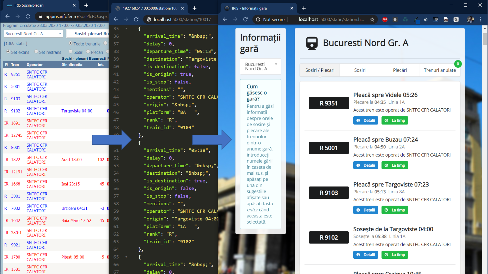

# CFR IRIS Scraper: Romanian Railways API



CFR S.A., the Romanian national railway infrastructure administration company offers an online live information service (based on ASPX forms with postback viewstate sending and event validation) for getting **near real-time data** about departures, arrivals and platforms where trains arrive in stations and trip delays and updates. At the time, this whole system lacks and API or even a decent, easy to use and easy to find interface for end users. 

This NodeJS & ExpressJS based API controls the PhantomJS headless webkit engine to extract data from the CFR webapp as requested in the URL API Endpoint and outputs reusable JSON data.

### Installation & Requirments
  - You need NodeJS and NPM installed on your system: [See their website for details](https://nodejs.org/en/download/). You may or may not have luck with portable versions.
  - Clone the repository and install the module dependencies:
```sh
$ cd cfr-iris-scraper
$ npm install
```
  - Now you need to install the PhantomJS binary: [See their website for details](http://phantomjs.org/download.html) - you can install it systemwide or drop the single-executable in the application directory. The expected command name is 'phantomjs' but you can change the string to your liking and environment needs (in index.js).
  - Run the API server:
```sh
$ node .
```
### Usage
Now you can point your browser to http://localhost:9090/station/ID to see the magic. ID is the unique station-unit code, you have [a list of those in this very nice repo](https://github.com/vasile/data.gov.ro-gtfs-exporter/blob/master/cfr.webgis.ro/stops.geojson). For example, to get a JSON object with the current departure/arrival board & delay information for the Bucharest North railway station (the main & biggest one in our country), you would point your browser or the URL variable for whatever app you are consuming the data with to: http://localhost:9090/station/10017.
### Ideas
While the official apps themselves work but may not look so great, romanian developers did their best to create some really cool open source projects and online services related to transportation and infrastructure. See [this live map](http://cfr.webgis.ro/), [this proprietary to GTFS converter](https://github.com/vasile/data.gov.ro-gtfs-exporter), [this trip planner](https://www.acceleratul.ro), etc.

Using this API and other public resources, you may create your own style of station departure board, delay-notification service, cool looking mobile app, while learning how to program and work with structured data ?
### License, disclaimer and known limitations
This is a completely open source project, built on open source modules and libraries and licensed under [Apache License 2.0](https://www.apache.org/licenses/LICENSE-2.0.html).

Also, you are completely responsible for what you do with it - keep in mind that CFR S.A. and InfoFer (the state-railway owned IT firm which builds their software) are not particularly transparent or third party developer friendly. If you do mass-scraping or develop some publicly accessible service that generates loads of traffic from the same server to them or clones their data to a database for various reasons, you may run into some trouble, [as this fellow enthusiast did while making a web trip-planner using CFR Calatori's timetable from their website](http://legi-internet.ro/blogs/index.php/cfr-crede-ca-are-monopol-pe-mersul-trenurilor-pe-internet).

But for tinkering, playing around and working with real-time data that clearly can't confuse anyone if the error is not from CFR themselves, you should be fine and on the right side of the law, at least from my experience. Maybe they'll offer their own API with proper rules and licensing at some point.

Known limitations:
- Currently you can only get the station departure & arrival (times, originating & destination station) board with delays and lines (where applicable) through the /station/ID endpoint, while detailed information about individual trips and trips between stations is provided by the CFR webpage. I may work on additional features.
- Requests are not authenticated and no rate limiting is implemented, so it's in no way ready to be exposed on the web.
- This is not particularly fast, because the CFR Webpage isn't either. You'll probably want background requests and caching. After the initial request is made, it'll wait 8 seconds before parsing the data. If data hasn't been displayed on the webpage, it will wait an additional 20 seconds. After this, the API will output a blank object - this may mean that the scraped web service is down, it is really slow to respond or there are really no current trips stopping at that particular station (at night or at a small stop, for example).
- This is scraping and parsing, so any structural update to the CFR webpage, while highly unlikely in the near future may break this.

Public information web-service provided by CFR S.A. through Informatica Feroviara: http://appiris.infofer.ro/SosPlcRO.aspx, appiris.infofer.ro/MyTrainRO.aspx, http://appiris.infofer.ro/MersTrenRo.aspx. This is information from infrastructure administration and not a specific passenger carrier. Official passenger timetables are found here: http://mersultrenurilorcfr.ro, http://infofer.ro/ and static data source with timetables updated at the end of each year: http://data.gov.ro/organization/sc-informatica-feroviara-sa
